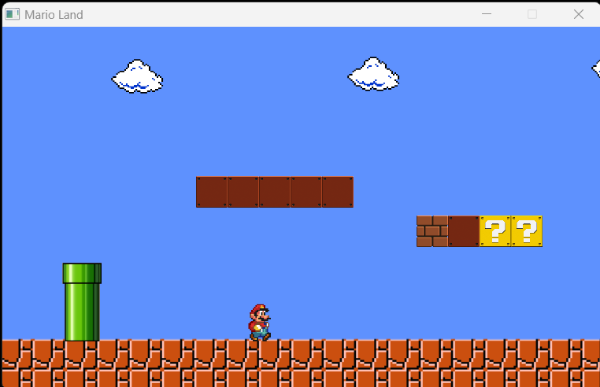
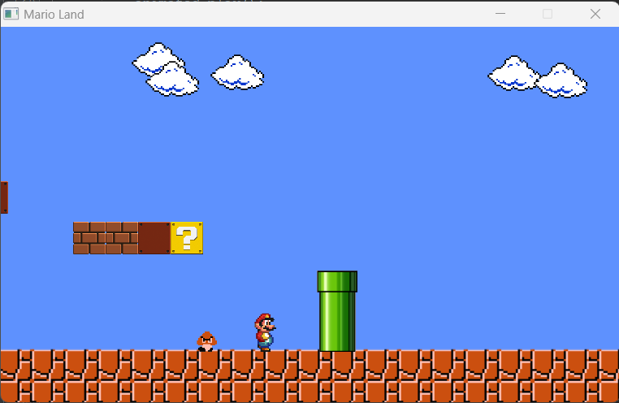

# MarioClone

This is a JavaFX game that I started working on in 2015 when I was a sophomore at University. 
The goal of this project is to eventually turn this into a proper game engine and create 
a fully fleshed out mario game with that game engine.  

# Video 
Checkout the YouTube short about this project.
https://www.youtube.com/shorts/ri_jO1cJkh8 

# Screenshots
 -----------

 

 
